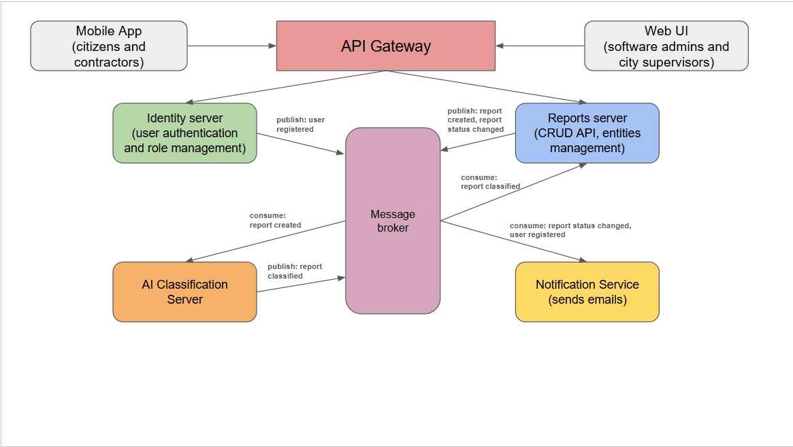

# UrbanPulse — Collaborative Urban Issue Tracker

The Collaborative Urban Issue Tracker (UrbanPulse) is a distributed, event-driven platform that allows citizens to report local infrastructure problems (potholes, broken lights, graffiti) via a mobile app. GPS coordinates automatically route each report to the responsible regional server. A microservices architecture separates concerns across eight independently deployable components, connected through a combination of synchronous REST/gRPC calls and asynchronous RabbitMQ events. An AI classification service automatically categorises reports by type and urgency and detects duplicates using a multimodal vision model.

Project developed as part of the Advanced Distributed Applications course at Universitatea Politehnica Timișoara.

## Team Members

- Copilu Tudor
- Cozma Gabriel
- Dobre Andrei
- Gherasim-Piroska Robert

## How It Works

When a citizen opens the mobile app and submits a report, the app uses their GPS coordinates to determine which regional server to contact. To keep the system distributed, the city is split into zones, each zone having its own regional server with its own database. If a report reaches the wrong server, that server forwards the data to the correct one, keeping data local to the area where the problem is while allowing the servers to stay in sync.

When a photo and description are uploaded, an AI agent automatically tags the report's category and checks whether the issue looks like a high-priority emergency. This helps city admins see the most dangerous problems first without manually sorting through every ticket.

## System Architecture

### Components

Each component can be deployed on a distinct server or container:

| Component | Platform / Language | Role & Responsibilities |
|---|---|---|
| **Mobile App** | React Native (iOS & Android), TypeScript / Expo SDK 51 | Primary citizen-facing interface. Allows users to submit issue reports with photos, text, and auto-captured GPS location. Provides push-notification feedback on report progress. |
| **Web UI** | React Native Web, TypeScript, served via Nginx | Administrator and supervisor dashboard. Enables triaging, assigning, and tracking resolution of reports. Connects to the API Gateway via HTTPS REST and receives real-time updates. |
| **API Gateway** | Node.js 22 / Express 5, TypeScript | Single entry point for all client traffic. Handles TLS termination, rate limiting, request routing, and JWT validation by delegating to the Identity Server. Forwards authenticated requests to internal services. |
| **Identity Server** | .NET 10 / C#, Duende IdentityServer 7, PostgreSQL 16 for user store | OpenID Connect / OAuth 2.0 provider. Manages user registration, login, and role assignment (citizen, contractor, supervisor, admin). |
| **Reports Server** | Java 21 / Spring Boot 3.3, Spring Data JPA + PostGIS | Core domain service. Exposes a CRUD REST API for report lifecycle management (create, read, update, close). Uses PostGIS for GPS-based zone routing and cross-zone sync. |
| **AI Classification Server** | Python 3.12 / FastAPI 0.111, OpenAI Vision API (GPT-4o), openai-python SDK 1.x | Consumes `report.created` events, sends photo and text to the OpenAI Vision API for classification (category, urgency level, duplicate detection), then publishes the result. |
| **Notification Service** | Java 21 / Spring Boot 3.3, Spring AMQP, Jackson, JavaMail | Consumes `report.status_changed` and `user.registered` events from the shared `notification.events` queue and dispatches user-facing notifications. Currently logs the notifications; email delivery is done via `spring-boot-starter-mail` (JavaMail/SMTP). |
| **Message Broker** | RabbitMQ 3.13, AMQP 0-9-1 protocol | Durable, async event bus decoupling producers from consumers. Hosts exchanges/queues for `report.created`, `report.status_changed`, `report.classified`, and `user.registered`. Guarantees at-least-once delivery. |

## Data Communication

### Synchronous Communication (REST / gRPC)

All client-facing traffic flows through the **API Gateway** over HTTPS (TLS 1.3). The gateway performs JWT validation by calling the **Identity Server** via the OpenID Connect introspection endpoint, then proxies the request to the appropriate internal service over plain HTTP on the private network. The **Web UI** additionally maintains a persistent **WebSocket** connection through the gateway to receive real-time report-status updates without polling.

Cross-zone synchronisation between regional **Reports Server** instances uses **gRPC** (Protocol Buffers v3) over mutual TLS. This bidirectional streaming connection supports both data replication (propagating new reports) and control messages (requesting zone reassignment), making it the backbone of the multi-zone coordination layer.

### Asynchronous Communication (Event Bus)

Loose coupling between backend services is achieved through **RabbitMQ 3.13** using the **AMQP 0-9-1** protocol. Producers publish events to named exchanges without knowledge of consumers; RabbitMQ routes messages to bound durable queues, guaranteeing at-least-once delivery via publisher confirms and consumer acknowledgements.

| Event | Published by | Consumed by |
|---|---|---|
| `report.created` | Reports Server (after a new report is persisted) | AI Classification Server |
| `report.classified` | AI Classification Server (after model inference) | Reports Server (updates the record) |
| `report.status_changed` | Reports Server (on any status transition) | Notification Service |
| `user.registered` | Identity Server (via a Duende IdentityServer event sink) | Notification Service |

### External Service Integrations

- **OpenAI Vision API (GPT-4o)** — the AI Classification Server makes synchronous HTTPS calls within its consumer loop, sending the report photo and text as a multimodal prompt and receiving a structured JSON response with category, urgency score, and duplicate flag.
- **Email via SMTP** — Email delivery is achieved `spring-boot-starter-mail`, which sends transactional emails over SMTP through a configured mail provider. This will use a custom Gmail address for better domain reputation.

### Connections & Protocol Summary

| Connection | Protocol / Technology | Purpose & Pattern |
|---|---|---|
| Clients → API Gateway | HTTPS / REST (TLS 1.3), WebSocket (wss://) | Synchronous request-response for CRUD operations and auth. WebSocket for real-time status push to Web UI. |
| API Gateway → Identity Server | HTTPS / OpenID Connect JWT introspection | Token validation and user-info retrieval on every authenticated request. |
| API Gateway → Reports Server | HTTP/1.1 REST (internal), JSON payloads | Proxied CRUD calls for report management. Internal network only. |
| Reports Server → Message Broker | AMQP 0-9-1 / RabbitMQ, Spring AMQP (spring-rabbit 3.x) | Publishes `report.created` and `report.status_changed` events. Async, publisher confirms enabled. |
| Identity Server → Message Broker | AMQP 0-9-1 / RabbitMQ, RabbitMQ.Client .NET SDK 6.x | Publishes `user.registered` events after successful registration. |
| AI Classification Server ← Message Broker | AMQP 0-9-1 / RabbitMQ, aio-pika 9.x (async Python) | Subscribes to the `report.created` queue, calls the OpenAI API, publishes `report.classified`. Event-driven pipeline. |
| Reports Server ← Message Broker | AMQP 0-9-1 / RabbitMQ, Spring AMQP consumer | Consumes `report.classified` to update the report record with AI-assigned category and urgency. |
| Notification Service ← Message Broker | AMQP 0-9-1 / RabbitMQ, Spring AMQP (spring-rabbit 3.x) | Consumes `report.status_changed` and `user.registered` from the `notification.events` queue (manual acks, dead-letter queue on failure) to trigger user notifications. |
| AI Classification Server → OpenAI | HTTPS / OpenAI REST API, openai-python SDK 1.x | Sends image + text payload; receives structured classification JSON. Synchronous call within async consumer loop. |
| Reports Server ↔ Reports Server (multi-zone) | gRPC (Protobuf) over mTLS, grpcio 1.63 | Data replication and cross-zone report synchronisation. Bi-directional streaming for zone handoff. |

## Deployment

The entire system is containerised with Docker, allowing multiple regional nodes to run on a single machine to demonstrate the distributed setup.
